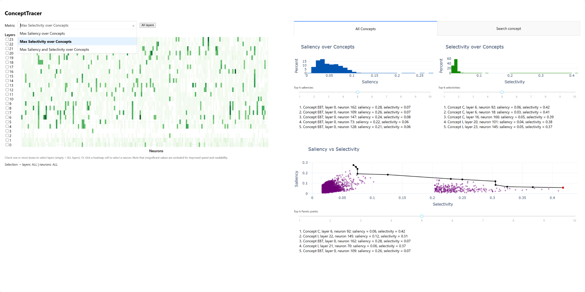

# ConceptTracer
Official repo: ConceptTracer: Interactive Analysis of Concept Saliency and Selectivity in Neural Representations

Neural networks deliver impressive predictive performance across a variety of tasks, but they are often opaque in their decision-making processes. Despite a growing interest in mechanistic interpretability, tools for systematically exploring the learned representations of tabular foundation models remain limited. In this work, we introduce ConceptTracer, an interactive system for analyzing neural representations through the lens of human-interpretable concepts. ConceptTracer integrates two information-theoretic measures that quantify concept saliency and selectivity, enabling researchers and practitioners to identify neurons that respond strongly to individual concepts. We demonstrate the utility of ConceptTracer on representations learned by TabPFN and show that our approach facilitates the discovery of interpretable neurons. Together, these capabilities provide a practical framework for investigating how neural networks like TabPFN encode concept-level information.



## Results reproduction
The results for the MIMIC-IV ED dataset presented in the paper can be reproduced by running the `calculations.py` script. 
Precomputed results are available in the `results` folder. 

# The Python package

## Overview

`concept-tracer` is a Python package that allows you to interactively analyze the concept saliency and selectivity in neural representations.
This package provides a Command Line Interface (CLI) to facilitate these operations. 

## Installation

To install the package, use the following command:

```sh
pip install concept-tracer
```

## Usage

`concept-tracer` provides two main CLI commands: `calculations` and `app`.

### Metric and p-value calculations

To calculate the concept saliency, selectivity, and p-values, use the `calculations` command.
By default, the MIMIC-IV ED dataset is used, which is available [here](https://github.com/nliulab/mimic4ed-benchmark).
Custom datasets and configurations are supported by adapting the data and config loaders in `templates.py`.
Below are the available options:

```sh
python -m concept_tracer.cli calculations [OPTIONS]
```

**Options:**

- `--root`: Root directory (default: `os.getcwd()`)
- `--get_config_fn`: Config loader, e.g., `templates:get_config` (default: `Config` in `config.py`)
- `--get_data_fn`: Data loader, e.g., `templates:get_data` (default: `get_data` in `helpers.py`)

### Dashboard web app

To explore and visualize the concept saliency and selectivity in neural representations, use the `app` command.
By default, the precomputed results on the MIMIC-IV ED dataset are used and displayed at `http://127.0.0.1:8050/`.
Custom results (like analytical p-value calculations) and configurations are supported by adapting the results and config loaders in `templates.py`.
Below are the available options:

```sh
python -m concept_tracer.cli app [OPTIONS]
```

**Options:**

- `--root`: Root directory (default: `os.getcwd()`)
- `--get_config_fn`: Config loader, e.g., `templates:get_config` (default: `Config` in `config.py`)
- `--get_results_fn`: Results loader, e.g., `templates:get_results` (default: `get_results` in `helpers.py`)
- `--task`: Task name (default: first task in config)
- `--granularity`: Granularity level (default: all granularities in config)

## Examples

### Metric and p-value calculations

```sh
python -m concept_tracer.cli calculations
```

### Dashboard web app

```sh
python -m concept_tracer.cli app --task hospitalization --granularity high_level
```

## CLI help

See the `--help` flag for more information.

### Main command help

```sh
python -m concept_tracer.cli --help
```

### Subcommand help

#### Calculations command

```sh
python -m concept_tracer.cli calculations --help
```

#### App command

```sh
python -m concept_tracer.cli app --help
```

## License

This project is licensed under the [MIT License](https://github.com/ml-lab-htw/concept-tracer/blob/main/LICENSE). See the `LICENSE` file for details.

## Authors

- Ricardo Knauer (HTW Berlin)